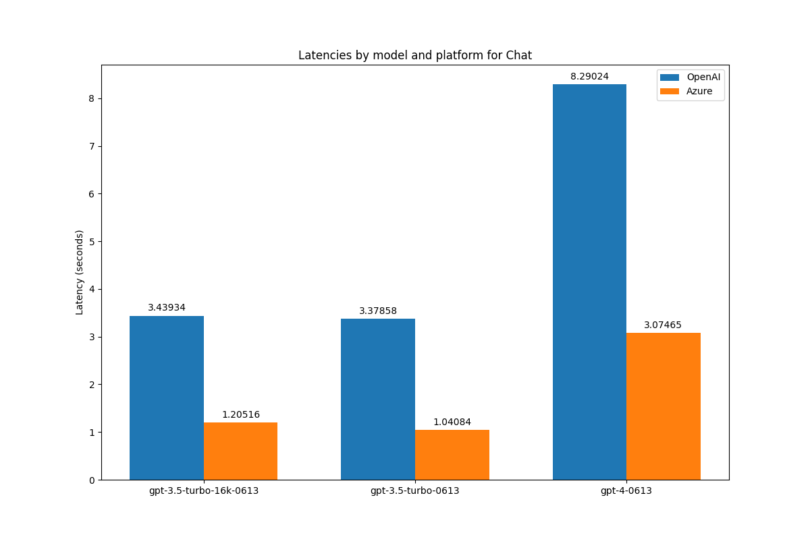
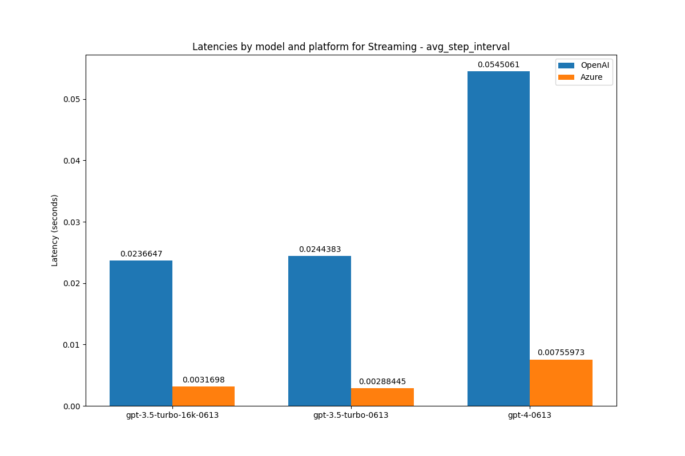

# Comparing Azure OpenAI and OpenAI: A Deep Dive

## Introduction
There are primarily two methods to deploy OpenAI LLM services: directly using OpenAI or through Azure OpenAI.

This repository contains code and insights into a comparison between OpenAI and Azure OpenAI.

<br />

## Getting Started
Have your .env ready as in .env.example (Need Azure OpenAI Deployment ready)

```bash
pip3 install requirements.txt
```

```
python3 test.py
```

<br />

## Visual Insights




<br />

## Takeaways
Azure OpenAI significantly outperforms OpenAI in speed, with up to 8x faster performance in streaming and 3x faster in chat / embedding models. 

While OpenAI is optimal for quick prototyping due to its simple setup, Azure's superior speed and responsiveness make it ideal for large-scale, performance-centric projects.

<br />

## [Further Reading on Medium](https://medium.com/@jaehoshin62/comparing-azure-openai-and-openai-a-deep-dive-dd18c642e976)

<br />

##  About the Author
- jaehoshin@gmail.com
- [LinkedIn](https://www.linkedin.com/in/jays0606/)
- [GitHub](https://github.com/jays0606)